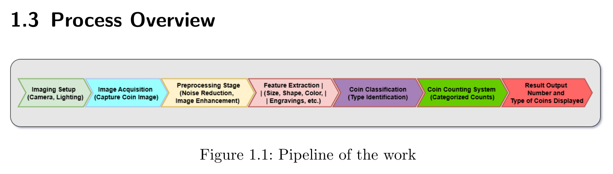

# Coin Detection and Estimation

## Project Overview

This project focuses on implementing a system to estimate the number and types of coins in an image using digital imaging and image processing techniques. The task involves setting up and calibrating an imaging system, analyzing data, and designing experiments to adapt to various imaging conditions.

## Process Pipeline

## Project Objectives

- **Imaging Setup Characterization and Calibration**
- **System Implementation:** MATLAB implementation of this project can be located at [Project](https://github.com/Wiredu2020/coin_detection/blob/main/coin_project.mlx). All needed functions for implementation are in [Functions](https://github.com/Wiredu2020/coin_detection/tree/main/functions).
- **Experiment Design:** We design experiments to accommodate extra measurements, particularly when imaging conditions (e.g., illumination, focal length) change.
- **Documentation:** Documentation of the project can be located at [Documentation](https://github.com/Wiredu2020/coin_detection/tree/main/Coin_Detection_And_Measurement.pdf).

## Collaborators

- Bright
- Olivier
